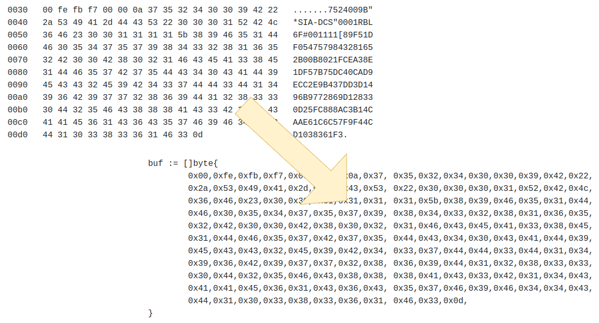

# Svelte :: little apps

Here's a place for some little apps not worthy of their own repo.

Deployed at https://kgolding.github.io/svelte-little-apps/

## Hex dump to byte array

Copy and paste in a hex dump and convert it to a byte array to paste into your code/tests.